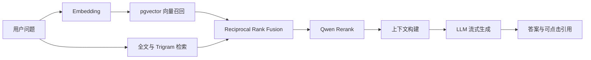
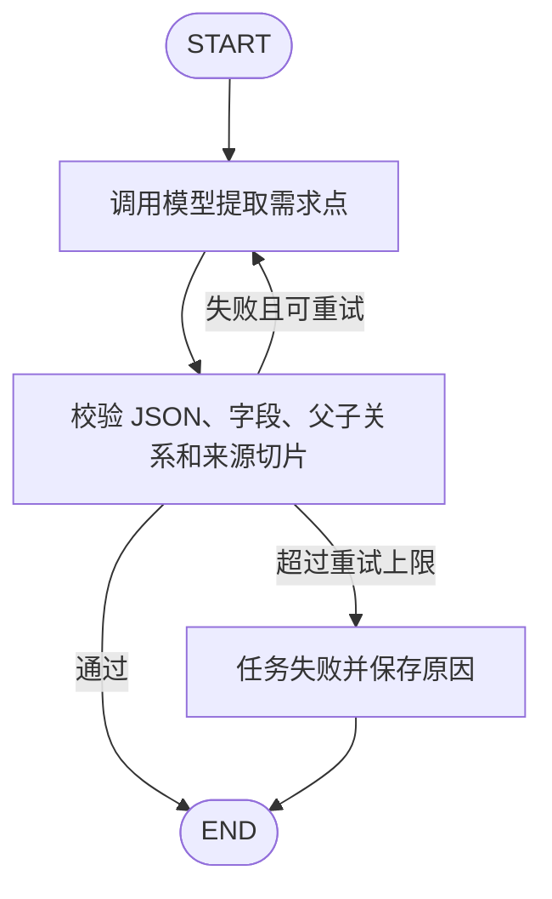
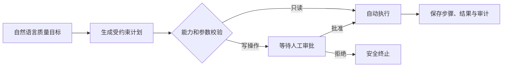
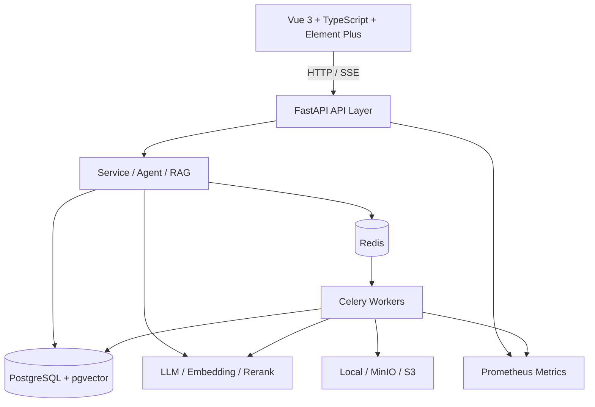

<div align="center">

# QA Copilot

### 面向测试团队的智能质量协作平台

从知识文档到需求拆解、测试用例、受控自动化执行与质量审计的一体化 AI 工作台。

[](https://www.python.org/)
[](https://fastapi.tiangolo.com/)
[](https://langchain-ai.github.io/langgraph/)
[](https://vuejs.org/)
[](https://www.postgresql.org/)
[](https://redis.io/)

</div>

---

## ✨ 项目简介

QA Copilot 面向测试开发、质量保障和研发协作场景，将分散的产品文档、需求与测试资产转化为可检索、可追溯、可审核的质量知识。

平台不是简单地“调用一次大模型”：它把检索增强生成、结构化校验、异步任务、权限边界、人工审批、长期记忆、工具调用和效果评估组合为完整工程链路。

```text
需求文档 / 操作手册 / 测试资产
                │
                ▼
       文档解析、切片与混合索引
                │
       ┌────────┴────────┐
       ▼                 ▼
   知识问答          需求解析与用例生成
       │                 │
  来源引用与记忆      结构校验与人工确认
       └────────┬────────┘
                ▼
      受控自动化执行与质量审计
                │
                ▼
    Supervisor Agent / MCP 工具服务
```

## 🚀 核心能力

| 模块 | 能力 |
| --- | --- |
| 项目空间 | 项目、成员、角色、功能模块和测试环境隔离 |
| 企业知识库 | PDF、DOCX、Markdown、TXT 上传，异步解析、切片、Embedding 与版本化索引 |
| RAG 知识问答 | 向量、全文和模糊检索并行召回，RRF 融合、Rerank 精排、来源引用和 SSE 流式回答 |
| 会话记忆 | Token 预算、短期消息、异步摘要、长期向量记忆和页面恢复 |
| 需求解析 | LangGraph 状态图、Pydantic 结构校验、来源白名单和校验反馈重试 |
| 测试用例生成 | 已有用例提取、AI 缺口补充、人工审核、版本发布和需求追溯 |
| 接口自动化 | 可视化请求、断言和变量提取，受控协议执行、环境白名单、任务取消和报告 |
| Supervisor Agent | 开放目标规划、能力白名单、实时权限复核、人工关卡、幂等执行和失败恢复 |
| MCP Server | 基于 Bearer Token 暴露项目、需求、用例和质量状态等只读工具 |
| 可观测与可靠性 | AI 调用日志、Token 统计、Prometheus 指标、事务性发件箱和后台补偿扫描 |

## 🧠 AI 链路

### 混合检索增强生成



- 检索候选必须满足项目、知识库、模块和索引版本边界。
- 引用编号由后端映射到真实文档切片，不允许模型自行编造来源。
- 无有效证据时返回明确的知识不足结果，而不是强行生成答案。

### 需求拆解工作流



LangGraph 只负责显式编排模型节点、校验节点和条件路由；数据库事务、权限判断和业务规则仍由 Service 层执行。

### 受控 Supervisor Agent



模型负责理解目标和提出计划，确定性代码负责权限、参数、状态迁移、审批和真正执行，避免模型直接获得数据库或高风险写权限。

## 🏗️ 技术架构



## 🧰 技术栈

| 分层 | 技术 |
| --- | --- |
| 前端 | Vue 3、TypeScript、Vite、Element Plus、Pinia、Alova |
| API | Python 3.14、FastAPI、Pydantic、SQLAlchemy AsyncIO |
| AI 应用 | LangChain、LangGraph、OpenAI-compatible API、MCP Python SDK |
| 检索 | PostgreSQL 全文检索、pg_trgm、pgvector、Embedding、Rerank、RRF |
| 任务 | Redis、Celery、Celery Beat、事务性发件箱 |
| 存储 | PostgreSQL、本地文件、MinIO / Amazon S3 兼容对象存储 |
| 自动化 | HTTPX、Playwright、Croniter |
| 质量 | pytest、Ruff、Vue Type Check、ESLint |
| 观测 | Prometheus、自定义 AI 调用与队列指标 |

## 📁 仓库结构

```text
qa-copilot/
├── qa-copilot-backend/       # FastAPI、Agent、RAG、Worker 和数据库脚本
│   ├── app/
│   │   ├── agents/           # LangGraph 工作流和 Supervisor
│   │   ├── api/              # HTTP API
│   │   ├── automation/       # 受控接口自动化执行
│   │   ├── models/           # SQLAlchemy 实体
│   │   ├── rag/              # 文档切片与检索器
│   │   ├── repositories/     # 数据访问
│   │   ├── services/         # 业务服务
│   │   ├── storage/          # 本地 / MinIO 文件存储
│   │   └── workers/          # Celery 后台任务
│   ├── sql/                  # PostgreSQL 初始化与升级脚本
│   └── tests/                # 后端自动化测试
└── qa-copilot-frontend/      # Vue 3 管理端
    ├── src/views/            # 页面
    ├── src/service/          # API 客户端
    ├── src/typings/          # TypeScript 接口类型
    ├── packages/             # 工作区共享包
    └── build/                # Vite 构建配置
```

## ⚡ 本地启动

### 1. 环境要求

- Python `3.14+` 与 [uv](https://docs.astral.sh/uv/)
- Node.js `20.19+`、pnpm `8.7+`
- PostgreSQL，并启用 `vector`、`pg_trgm` 扩展
- Redis

### 2. 启动后端

```powershell
cd qa-copilot-backend
Copy-Item .env.example .env

# 安装依赖
uv sync --extra dev

# 创建数据库后，使用 PostgreSQL 客户端先执行基础结构，再按 sql/ 中的功能脚本升级
psql -U postgres -d qa_copilot -f sql/postgresql_schema.sql
psql -U postgres -d qa_copilot -f sql/initial_data.sql

# 启动 API
uv run uvicorn app.main:app --reload
```

启动前请在 `.env` 中至少修改：

- `DATABASE_URL`
- `REDIS_URL`
- `SECRET_KEY`
- `DATA_ENCRYPTION_KEY`

生成独立的 Fernet 数据加密密钥：

```powershell
uv run python -c "from cryptography.fernet import Fernet; print(Fernet.generate_key().decode())"
```

### 3. 启动前端

```powershell
cd qa-copilot-frontend
pnpm install
pnpm dev
```

默认地址：

- 管理端：<http://localhost:9527>
- FastAPI：<http://127.0.0.1:8000>
- OpenAPI：<http://127.0.0.1:8000/docs>
- MCP：<http://127.0.0.1:8000/api/mcp/>

### 4. 启动后台任务

不同类型的长任务使用独立队列，避免模型调用、索引和自动化执行互相阻塞：

```powershell
cd qa-copilot-backend

# 文档索引
uv run celery -A app.core.celery_app:celery_app worker -Q knowledge-index --pool=solo --concurrency=1 -l INFO

# 需求解析和用例生成
uv run celery -A app.core.celery_app:celery_app worker -Q requirement-analysis --pool=solo --concurrency=1 -l INFO
uv run celery -A app.core.celery_app:celery_app worker -Q case-generation --pool=solo --concurrency=1 -l INFO

# 自动化、通知、Supervisor 和可靠投递
uv run celery -A app.core.celery_app:celery_app worker -Q automation-execution --pool=solo --concurrency=1 -l INFO
uv run celery -A app.core.celery_app:celery_app worker -Q notifications --pool=solo --concurrency=1 -l INFO
uv run celery -A app.core.celery_app:celery_app worker -Q supervisor-execution --pool=solo --concurrency=1 -l INFO
uv run celery -A app.core.celery_app:celery_app worker -Q system-outbox --pool=solo --concurrency=1 -l INFO
uv run celery -A app.core.celery_app:celery_app beat -l INFO
```

## ✅ 验证

```powershell
# 后端
cd qa-copilot-backend
uv run ruff check app tests
uv run pytest

# 前端
cd ..\qa-copilot-frontend
pnpm typecheck
pnpm build
```

## 📊 可复现评测摘要

基于真实业务知识文档构建 200 条分层问题集，覆盖事实、流程、约束、故障排查和对比场景：

| 指标 | 结果 |
| --- | ---: |
| Hit@10 | 99.0% |
| Recall@10 | 98.5% |
| Mean Reciprocal Rank | 0.9354 |
| 检索 P95 | 0.92 s |
| 端到端生成成功率 | 200 / 200 |
| 引用命中率 | 96.0% |

评测集包含 200 条经过人工确认的 Gold 数据，并通过问题唯一性、来源切片存在性和原文证据包含规则校验。评测数据和报告不随源码仓库公开。

## 🔐 安全与可靠性设计

- **数据权限**：普通用户只能访问所属项目，管理员权限与项目数据权限分层校验。
- **工具边界**：Supervisor 只能选择注册能力；MCP 默认仅开放只读工具。
- **人工关卡**：用例发布、自动化执行等写操作必须经过人工确认或审批。
- **网络防护**：自动化、Webhook 和测试工具执行前校验目标地址，默认阻止未授权内网、回环和敏感地址。
- **密钥保护**：JWT 密钥与数据加密密钥分离，AI Provider Key 和环境变量密文存储。
- **可靠投递**：业务状态和发件箱事件在同一个 PostgreSQL 事务提交，再异步投递 Celery。
- **失败恢复**：PENDING / RUNNING 超时扫描、Worker 心跳、有限重试、补偿取消和明确失败终态。
- **全链路审计**：记录模型、Prompt、Token、耗时、工具参数摘要、操作者、审批和执行结果。

## 🧭 设计原则

1. 模型负责理解和建议，确定性代码负责权限、状态和副作用。
2. 没有来源证据就不生成确定性结论。
3. 数据库先保存恢复点，再发起长时间模型或工具调用。
4. 写操作必须可预览、可审批、可审计、可幂等重试。
5. 指标必须来自固定数据集和可复现脚本，不用主观体验代替评估。

## 📄 License

管理端基于 Soybean Admin Element Plus 二次开发，并保留其原始 MIT License。其余代码用于个人学习、作品展示与技术交流；如需用于商业场景，请先确认相关依赖及上游项目许可证。

---

<div align="center">

**QA Copilot — 让测试知识可检索，让 AI 结果可追溯，让自动化执行可控制。**

</div>
